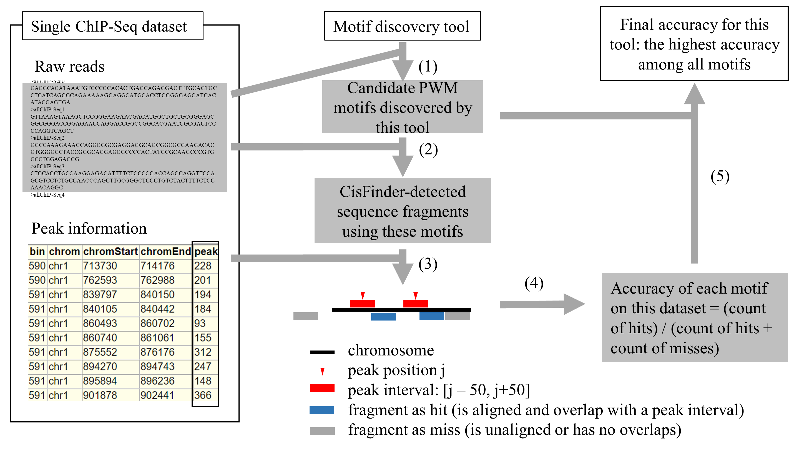

# Table of contents

- [vConv paper](#vconv-paper)
- [Prerequisites for all](#prerequisites-for-all)
  * [Basics](#basics)
  * [Python packages](#python-packages)
  * [R packages](#r-packages)
  * [the vConv layer](#the-vconv-layer)
- [Step 1: Reproduce Figures 2-3, Supplementary Figures 5-10, and Supplementary Tables 2-3 (benchmarking models on motif identification)](#step-1-reproduce-figures-2-3-supplementary-figures-5-10-and-supplementary-tables-24-benchmarking-models-on-motif-identification)
  * [1.1 Prepare datasets](#11-prepare-datasets)
  * [1.2 Train and evaluate models needed for reproducing these figures](#12-train-and-evaluate-models-needed-for-reproducing-these-figures)
    + [1.2.1 Train the models directly](#121-train-the-models-directly)
    + [1.2.2 Use the pre-trained results](#122-use-the-pre-trained-results)
  * [1.3 Prepare summary files for reproducing figures and tables from datasets and results above](#13-prepare-summary-files-for-reproducing-figures-and-tables-from-datasets-and-results-above)
  * [1.4 Reproduce Figures](#14-reproduce-figures)
    + [1.4.1 Reproduce Figure 2](#141-reproduce-figure-2)
    + [1.4.2 Reproduce Figure 3](#142-reproduce-figure-3)
    + [1.4.3 Reproduce Supplementary Figure 5](#143-reproduce-supplementary-figure-5)
    + [1.4.4 Reproduce Supplementary Figure 6](#144-reproduce-supplementary-figure-6)
    + [1.4.5 Reproduce Supplementary Figure 7](#145-reproduce-supplementary-figure-7)
    + [1.4.6 Reproduce Supplementary Figure 8](#146-reproduce-supplementary-figure-8)
    + [1.4.7 Reproduce Supplementary Figure 9](#147-reproduce-supplementary-figure-9)
    + [1.4.8 Reproduce Supplementary Figure 10](#148-reproduce-supplementary-figure-10)
    + [1.4.9 Reproduce Supplementary Table 2](#149-reproduce-supplementary-table-2)
    + [1.4.10 Reproduce Supplementary Table 3](#1410-reproduce-supplementary-table-3)
- [Step 2: Reproduce Figure 4 (benchmarking models on motif discovery)](#step-2-reproduce-figure-4-benchmarking-models-on-motif-discovery)
  * [2.1 Prepare datasets needed by Figure 4](#21-prepare-datasets-needed-by-figure-4)
  * [2.2 Generate results needed by Figure 4](#22-generate-results-needed-by-figure-4)
    + [2.2.1 Generate the results](#221-generate-the-results)
      - [2.2.1.1 step (1)](#2211-step-1)
      - [2.2.1.2 step (2)](#2212-step-2)
      - [2.2.1.3 steps (3-5)](#2213-steps-3-5)
    + [2.2.2 Use the pre-computed version](#222-use-the-pre-computed-version)
  * [2.3 Reproduce Figure 4](#23-reproduce-figure-4)
- [Step 3: Reproduce Supplementary Fig. 11 B-I (theoretical analysis)](#step-3-reproduce-supplementary-fig-11-b-i-theoretical-analysis)
  * [3.1 Prepare datasets and results needed by Supp. Fig. 11 B-I](#31-prepare-datasets-and-results-needed-by-supp-fig-11-b-i)
  * [3.2 Reproduce Supplementary Fig. 11 B-I](#32-reproduce-supplementary-fig-11-b-i)

# vConv paper
This is the repository for reproducing figures and tables in the paper [Identifying complex sequence patterns with a variable-convolutional layer effectively and efficiently](https://doi.org/10.1101/508242).

A Keras-based implementation of vConv is available at [https://github.com/gao-lab/vConv](https://github.com/gao-lab/vConv).

# Prerequisites for all

## Basics


- Imagemagick
- Python (version 2)
- R
- bedtools
- DREME (version 5.0.1)
- MEME-ChIP (version 5.0.1)
- CisFinder


## Python packages

- numpy
- h5py
- pandas
- seaborn
- scipy
- keras (version 2.2.4)
- tensorflow (version 1.3.0)
- sklearn

Alternatively, if you want to guarantee working versions of each dependency, you can install via a fully pre-specified environment.
```{bash}
conda env create -f corecode/environment_vConv.yml
```

## R packages

- ggpubr
- data.table
- readxl
- foreach
- ggseqlogo
- magick

## the vConv layer
```{bash}
rm -fr ./vConv
git clone https://github.com/gao-lab/vConv
cp -r ./vConv/corecode ./
```

# Step 1: Reproduce Figures 2-3, Supplementary Figures 5-10, and Supplementary Tables 2,4 (benchmarking models on motif identification)

## 1.1 Prepare datasets

Run the following codes to prepare the datasets.

```{bash}
wget -P ./ ftp://ftp.cbi.pku.edu.cn/pub/supplementary_file/VConv/Data/data.tar.gz
tar -C ./ -xzvf ./data.tar.gz
```

This tarball archive contains both simulated and published datasets. The following code has been used to generate the simulation dataset:

```{bash}
mkdir -p ./data/JasperMotif
cd ./data/JasperMotif/
python generateSequencesForSimulation.py
cd -
```

## 1.2 Train and evaluate models needed for reproducing these figures

The training takes about 15 days on a server with 1 CPU cores, 32G memory, and one NVIDIA 1080 Ti GPU card. The user can either train the models by themselves or use the pre-trained results.

### 1.2.1 Train the models directly
- Run the following codes to train the models.

```{bash}
cd ./train/JasperMotifSimulation
python trainAllVConvBasedAndConvolutionBasedNetworksForSimulation.py
python trainAllVConvBasedNetworksWithoutMSLForSimulation.py
cd -
```

```{bash}
cd ./train/ZengChIPSeqCode
python trainAllVConvBasedAndConvolutionBasedNetworksForZeng.py
cd -
```


```{bash}
cd ./train/DeepBindChIPSeqCode2015
python trainAllVConvBasedAndConvolutionBasedNetworksForDeepBind.py
cd -
```


```{bash}
cd ./train/convergenceSpeed
python estimateConvergenceSpeed.py
cd -
```


install basenji from https://github.com/calico/basenji
```{bash}
cd ./basset/vConv/9layersvConv/
python TrainBasenjiBasset.py
cd -

cd ./basset/vConv/basenjibasset/
python basenji_train.py
cd -

cd ./basset/vConv/singlelayervConv/
python TrainBasenjiBasset.py
cd -
```

### 1.2.2 Use the pre-trained results

- Run the following codes to obtain the pre-trained models.

```{bash}
mkdir -p ./output
wget -P ./output/ ftp://ftp.cbi.pku.edu.cn/pub/supplementary_file/VConv/Data/result.tar.gz
tar -C ./output/ -xzvf ./output/result.tar.gz
```

## 1.3 Prepare summary files for reproducing figures and tables from datasets and results above

Note that
- Both the original datasets ("./data") and the trained results ("./output/result/") are needed.
- The scripts below must be run in the order displayed.

```{bash}
cd ./output/code
python checkResultsForSimulation.py
python checkResultsForSimulationWithoutMSL.py
python checkResultsForZengCase.py.py
python checkResultsForDeepBindCase.py
python extractMaskedKernelsFromSimulation.py
python prepareInputForTomtom.py
python useTomtomToCompareWithRealMotifs.py
cd -
```

## 1.4 Reproduce Figures

### 1.4.1 Reproduce Figure 2

```{bash}
Rscript ./vConvFigmain/code/generate_fig_2.R
```

The figure generated is located at `./vConvFigmain/result/Fig.2/Fig.2.png`.

### 1.4.2 Reproduce Figure 3

```{bash}
Rscript ./vConvFigmain/code/generate_fig_3.R
```
The figure generated is located at `./vConvFigmain/result/Fig.3/Fig.3.png`.

### 1.4.3 Reproduce Supplementary Figure 5

```{bash}
Rscript ./vConvFigmain/code/generate_supplementary_figure_5.R
```

The figure generated is located at `./vConvFigmain/result/Supplementary.Fig.5/Supplementary.Fig.5.png`.

### 1.4.4 Reproduce Supplementary Figure 6

```{bash}
Rscript ./vConvFigmain/code/generate_supplementary_figure_6.R
```
The figure generated is located at `./vConvFigmain/result/Supplementary.Fig.6/Supplementary.Fig.6.png`.

### 1.4.5 Reproduce Supplementary Figure 7

```{bash}
cd ./output/code
python checkResultComparedZengSearch.py
cd -
```
The figure generated is located at
- Supp. Fig. 7A: `output/ModelAUC/ChIPSeq/Pic/worseData/DataSize.png`
- Supp. Fig. 7B: `output/ModelAUC/ChIPSeq/Pic/worseData/DataSizeWorseCase.png`
- Supp. Fig. 7C: `"output/ModelAUC/ChIPSeq/Pic/convolution-based network from Zeng et al., 2016Boxplot.png"`

### 1.4.6 Reproduce Supplementary Figure 8

```{bash}
cd ./output/SpeedTest/code
python DrawLoss.py
cd -
```

The figure generated is located at
- 2 motifs: `output/SpeedTest/Png/2.jpg`
- 4 motifs: `output/SpeedTest/Png/4.jpg`
- 6 motifs: `output/SpeedTest/Png/6.jpg`
- 8 motifs: `output/SpeedTest/Png/8.jpg`
- TwoDiffMotif1: `output/SpeedTest/Png/TwoDiff1.jpg`
- TwoDiffMotif2: `output/SpeedTest/Png/TwoDiff2.jpg`
- TwoDiffMotif3: `output/SpeedTest/Png/TwoDiff3.jpg`
- Basset: `output/SpeedTest/Png/basset.jpg`

### 1.4.7 Reproduce Supplementary Figure 9

```{bash}
Rscript ./vConvFigmain/code/generate_supplementary_figure_9.R
```

The figure generated is located at `./vConvFigmain/result/Supplementary.Fig.9/Supplementary.Fig.9.png`.

### 1.4.8 Reproduce Supplementary Figure 10

```{bash}
Rscript ./vConvFigmain/code/generate_supplementary_figure_10.R
```

The figure generated is located at `./vConvFigmain/result/Supplementary.Fig.10/Supplementary.Fig.10.png`.


### 1.4.9 Reproduce Supplementary Table 2

By now this table should have been generated at `./vConvFigmain/supptable23/SuppTable2.csv`. Use the script below to reproduce it again.

```{bash}
cd ./output/code
python checkResultsForSimulation.py
cd -
```


### 1.4.10 Reproduce Supplementary Table 3

By now this table should have been generated at `./vConvFigmain/supptable23/SuppTable3.csv`. Use the script below to reproduce it again.

```{bash}
cd ./output/code
python checkResultsForSimulationWithoutMSL.py
cd -
```


# Step 2: Reproduce Figure 4 (benchmarking models on motif discovery)
## 2.1 Prepare datasets needed by Figure 4

```{bash}
mkdir -p ./vConvMotifDiscovery/ChIPSeqPeak/
wget -P ./vConvMotifDiscovery/ChIPSeqPeak/  http://hgdownload.cse.ucsc.edu/goldenPath/hg19/encodeDCC/wgEncodeAwgTfbsUniform/files.txt
for file in `cut -f 1 ./vConvMotifDiscovery/ChIPSeqPeak/files.txt|grep narrowPeak.gz`
do
    wget -P ./vConvMotifDiscovery/ChIPSeqPeak/  http://hgdownload.cse.ucsc.edu/goldenPath/hg19/encodeDCC/wgEncodeAwgTfbsUniform/${file}
    gunzip ./vConvMotifDiscovery/ChIPSeqPeak/${file}
done

mkdir -p ./data
wget -P ./data/ http://hgdownload.soe.ucsc.edu/goldenPath/hg19/bigZips/hg19.fa.gz
gunzip ./data/hg19.fa.gz
```

## 2.2 Generate results needed by Figure 4

The user could either generate the results by themselves, or use the pre-computed version. Note that both the data files and the results are needed for reproducing Figure 4.

### 2.2.1 Generate the results

See Suppelementary Fig. 4. (shown below) for description of each step.




#### 2.2.1.1 step (1)

```{bash}
## extract sequences
cd ./vConvMotifDiscovery/code/MLtools
python extractSequences.py
cd -

## generate motifs by CisFinder, DREME, and MEME-ChIP
cd ./vConvMotifDiscovery/code/MLtools
python generateMotifsByCisFinder.py
python generateMotifsByDREME.py
python generateMotifsByMEMEChIP.py
cd -

## generate motifs by vConv-based
cd ./vConvMotifDiscovery/code/vConvBased
python generateMotifsByVConvBasedNetworks.py
cd -

```

#### 2.2.1.2 steps (2-3)

```{bash}
cd ./vConvMotifDiscovery/code/CisfinderFile
python convertIntoCisfinderFormat.py
python splitIntoIndividualMotifFiles.py
python scanSequencesWithCisFinder.py
python combineCisFinderResults.py
cd -
```

#### 2.2.1.3 steps (4-5)

```{bash}
cd ./vConvMotifDiscovery/code/Analysis
python computeAccuracy.py
python summarizeResults.py
cd -
```


### 2.2.2 Use the pre-computed version

```{bash}
wget -P ./vConvMotifDiscovery/output/ ftp://ftp.cbi.pku.edu.cn/pub/supplementary_file/VConv/Data/AUChdf5.tar.gz
tar -C ./vConvMotifDiscovery/output/ -xzvf ./vConvMotifDiscovery/output/AUChdf5.tar.gz
```


## 2.3 Reproduce Figure 4

```{bash}
Rscript ./vConvFigmain/code/generate_fig_4.R
```

The figure generated is located at `vConvFigmain/result/Fig.4/Fig.4.png`


# Step 3: Reproduce Supplementary Fig. 11 B-I (theoretical analysis)

## 3.1 Prepare datasets and results needed by Supp. Fig. 11 B-I

```{bash}
cd theoretical/code/
python runSimulation.py
python trainCNN.py
cd -
```

## 3.2 Reproduce Supplementary Fig. 11 B-I
```{bash}
cd theoretical/code/
python plotFigures.py
cd -
```

The figure generated is located at:
- Supp. Fig. 11B: `theoretical/Motif/ICSimu/simuMtf_Len-8_totIC-10.png`
- Supp. Fig. 11C: `theoretical/Motif/ICSimu/simuMtf_Len-23_totIC-12.png`
- Supp. Fig. 11D: `theoretical/figure/simuMtf_Len-8_totIC-10.png`
- Supp. Fig. 11E: `theoretical/figure/simuMtf_Len-23_totIC-12.png`
- Supp. Fig. 11F: `theoretical/figure/simuMtf_Len-8_totIC-10rank.png`
- Supp. Fig. 11G: `theoretical/figure/simuMtf_Len-23_totIC-12rank.png`
- Supp. Fig. 11H: `theoretical/figure/simu01.png`
- Supp. Fig. 11I: `theoretical/figure/simu02.png`


